nginx-http-flv-module搭建从0到1实现直播推流


https://www.yuque.com/nhjclxc/clq5m5/dhc9tt9g836yxg4z?singleDoc# 《nginx-http-flv-module搭建从0到1实现直播推流》


所有源码可访问：[https://github.com/nhjclxc/Go-Live-Streaming](https://github.com/nhjclxc/Go-Live-Streaming)


# 安装包准备
1. nginx安装包：[https://nginx.org/download/nginx-1.18.0.tar.gz](https://nginx.org/download/nginx-1.18.0.tar.gz)
2. nginx的http-flv模块：[https://github.com/winshining/nginx-http-flv-module](https://github.com/winshining/nginx-http-flv-module)
3. 【其他的，这个可选，如果选择这个那么就无法实现http-flv】nginx的rtmp模块：[https://github.com/arut/nginx-rtmp-module](https://github.com/arut/nginx-rtmp-module)，[https://github.com/arut/nginx-rtmp-module/releases/tag/v1.2.2](https://github.com/arut/nginx-rtmp-module/releases/tag/v1.2.2)


✅ 解决方案：使用包含 HTTP-FLV 的 nginx-rtmp 模块

✅ 方法 1：确认你使用的是支持 `flv_live` 的版本（如 [winshining/nginx-http-flv-module](https://github.com/winshining/nginx-http-flv-module)）

标准的 `nginx-rtmp-module`（arut 版）只支持 RTMP 和 HLS，不支持 `flv_live`。  
你需要换成 `**nginx-http-flv-module**`（由 `winshining` 提供），它才支持 `flv_live`。


是的，✅ `**nginx-http-flv-module**`** 完全可以作为 RTMP 推流+拉流中心**，并且提供额外的 **HTTP-FLV、HLS、API 状态接口**，比标准 `nginx-rtmp-module` 更适合现代直播需求。


| 能力 | `nginx-http-flv-module`<br/>（winshining） | `nginx-rtmp-module`<br/>（arut） |
| --- | --- | --- |
| RTMP 推流/拉流 | ✅ 支持 | ✅ 支持 |
| HTTP-FLV 直播播放 | ✅ 支持（通过 `flv_live on`<br/>） | ❌ 不支持 |
| HLS 直播播放 | ✅ 支持（`hls on`<br/>） | ✅ 支持 |
| API 接口（统计流信息） | ✅ 支持 `/stat`<br/>, `/control`<br/> 等 | ✅ 支持（样式不同） |
| 多路应用管理 | ✅ 支持多个 application | ✅ 支持 |
| 较活跃维护 | ✅ 是 | ❌ 维护较少 |
| 实时性 & 稳定性 | ✅ 好 | ✅ 好 |


✅ 推流+拉流工作流程示意：

```yaml
[OBS/FFmpeg 推流] ---> nginx-http-flv-module (RTMP)

[RTMP 拉流] ---> 播放器 (VLC / FFmpeg)
[HTTP-FLV 拉流] ---> flv.js 浏览器播放器
[HLS 拉流] ---> hls.js / Safari

```


---

✅ 是否支持推拉中转？

是的，可以通过配置 `relay` 机制实现“中转”功能，例如：

```plain
application forward {
    live on;
    pull rtmp://other-source-ip/live name=room1 static;
}
```

或：

```plain
push rtmp://another-server/live;
```

但 relay 主要由 `nginx-rtmp-module` 提供，`nginx-http-flv-module` 也可以使用 relay，但需要搭配正确版本（它是向后兼容的）。


# 安装编译工具依赖
`sudo dnf install gcc make pcre pcre-devel openssl openssl-devel`

# 安装nginx-http-flv直播推流与拉流的中转节点


## 将1中下载的两个安装包上传至：`/home/go/live-go/temp`


## 命令行进入：`/home/go/live-go/temp`


## 安装nginx
1. 首先在**/home/go/live-go/temp**目录执行：`tar -zxvf nginx-1.18.0.tar.gz `解压nginx
2. 接着解压**nginx-http-flv-module**，执行：`tar -zxvf nginx-http-flv-module-1.2.12.tar.gz`
3. 确保解压出来的**nginx-1.18.0**文件夹与解压出来的**nginx-http-flv-module-1.2.12**文件夹在同一个目录下

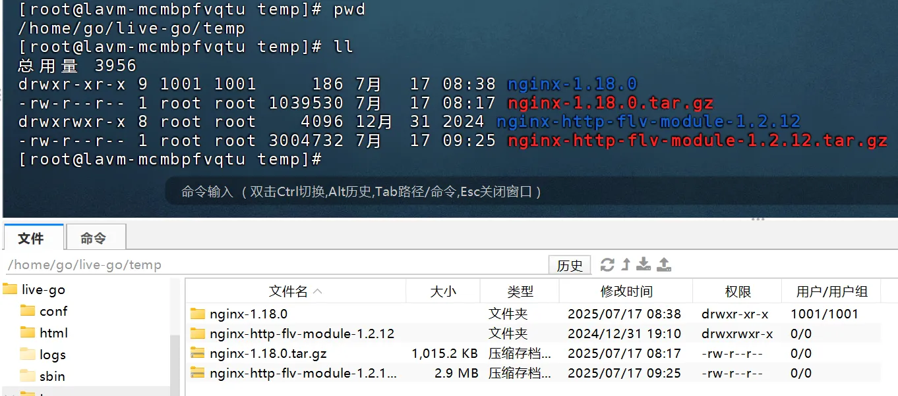


4. 编译nginx，先进入**/home/go/live-go/temp/nginx-1.18.0**目录，接着执行命令：`./configure --prefix=/home/go/live-go  --add-module=../nginx-http-flv-module-1.2.12  --with-http_ssl_module`（`/home/go/live-go`是nginx最后安装目录，`../nginx-http-flv-module-1.2.12`的意思是安装这个nginx的时候去加载nginx-rtmp这个模块，`..`表示上一级目录下的nginx-http-flv-module-1.2.12）

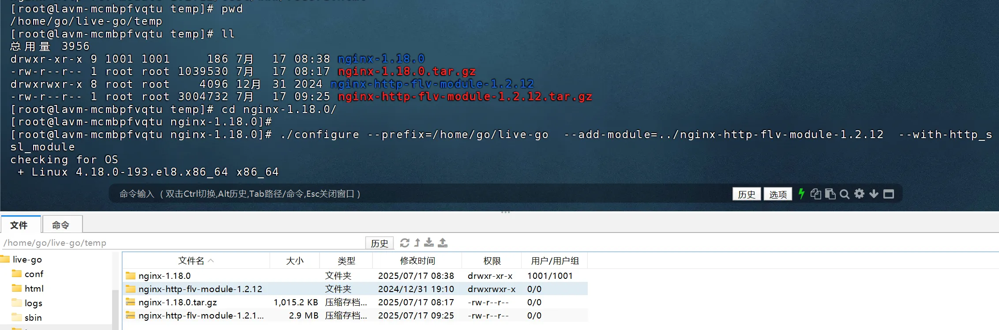


5. 安装nginx：在当前目录执行：`make install`

在目标目录下出现了：conf、html、logs、sbin等目录

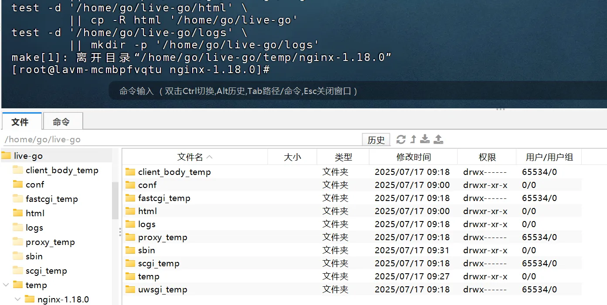


6. 编写nginx.conf【目前仅支持flv】

```yaml
worker_processes  1;

events {
    worker_connections  1024;
}

http {
    include       mime.types;
    default_type  application/octet-stream;

    sendfile        on;
    keepalive_timeout  65;

    # 支持跨域访问（flv.js 需要）
    add_header 'Access-Control-Allow-Origin' '*' always;
    add_header 'Access-Control-Expose-Headers' 'Content-Length,Content-Range' always;

    server {
        # livego使用7001实现HTTP-FLV的拉流、推流
        listen       7001;
        server_name  localhost;

        # 用于 flv.js 播放的 HTTP-FLV 流路径：
        # 播放地址：http://localhost:7001/live/room1.flv
        location /live {
            flv_live on;         # 开启 HTTP-FLV
            chunked_transfer_encoding on;  # 使用 chunked 编码传输
            add_header 'Cache-Control' 'no-cache';
            add_header 'Access-Control-Allow-Origin' '*';
            add_header 'Access-Control-Allow-Credentials' 'true';
        }

        # 可选：用于测试的静态播放页面（index.html）
        location / {
            root /home/go/live-go/html;
            index index.html;
        }
    }
}

rtmp {
    server {
        # livego使用7001实现 RTMP 的拉流、推流
        listen 1935;
        chunk_size 4096;

        application live {
            live on;
            record off;

            # 可选：HLS 同时开启
            # hls on;
            # hls_path /tmp/hls;
            # hls_fragment 3;
            # hls_playlist_length 10;
        }
    }
}

```

7. 编写拉流直播index.html页面，并将改文件上传到**/home/go/live-go/html**目录

```html
<!DOCTYPE html>
<html lang="zh">
<head>
    <meta charset="UTF-8">
    <title>FLV Live 播放器</title>
    <script src="https://cdn.jsdelivr.net/npm/flv.js@latest/dist/flv.min.js"></script>
</head>
<body>
<h2>FLV 直播播放</h2>

<label for="streamUrl">直播流地址（例如：http://localhost:7001/live/room1.flv）:</label><br>
<input type="text" id="streamUrl" value="http://localhost:7001/live/room1.flv" style="width: 600px;">
<button onclick="startPlay()">播放</button>

<hr>

<video id="videoElement" controls autoplay style="width: 800px; height: 450px;"></video>

<script>
    let player;

    function startPlay() {
        const url = document.getElementById("streamUrl").value.trim();
        const videoElement = document.getElementById("videoElement");

        // 销毁旧的 player 实例
        if (player) {
            player.destroy();
            player = null;
        }

        if (flvjs.isSupported()) {
            player = flvjs.createPlayer({
                type: 'flv',
                url: url
            });

            player.attachMediaElement(videoElement);
            player.load();
            player.play();
        } else {
            alert("当前浏览器不支持 flv.js 播放！");
        }
    }
</script>
</body>
</html>

```

8. 启动nginx：`/home/go/live-go/sbin/nginx -p /home/go/live-go/ -c conf/nginx.conf`

重启使用：`/home/go/live-go/sbin/nginx -s reload`

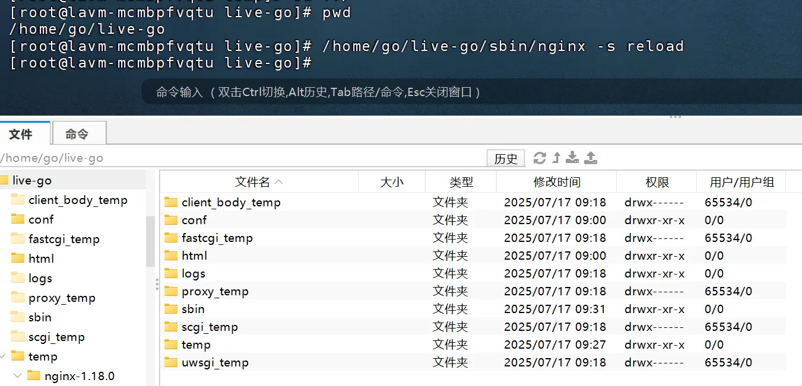


9. 访问页面

[http://117.72.xxx.xxx/](http://117.72.xxx.xxx/)

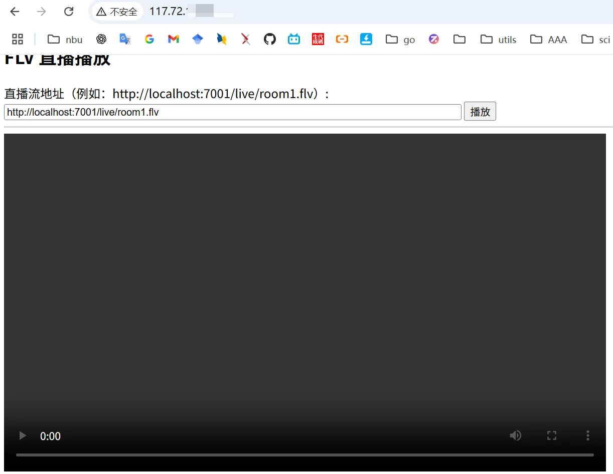


10. 至此，基于 nginx-http-flv-module 模块的 nginx 已配置完成，可作为直播推流与拉流的中转节点。接下来将使用 Go 语言的 LiveGo（[github.com/gwuhaolin/livego](https://github.com/gwuhaolin/livego)）框架实现推流与拉流服务。


## z


# 安装livego实现推流与拉流服务
使用 LiveGo（[https://github.com/gwuhaolin/livego](https://github.com/gwuhaolin/livego)）框架 实现推流与拉流服务


## git clone克隆livego项目
D:\code\go\livego>执行：`git clone [https://github.com/gwuhaolin/livego](https://github.com/gwuhaolin/livego)`


## 本地（Windows）编译Linux环境下的livego可执行文件
`D:\code\go\livego>set GOOS=linux`

`D:\code\go\livego>set GOARCH=amd64`

`D:\code\go\livego>go build -o livego-linux-amd64`

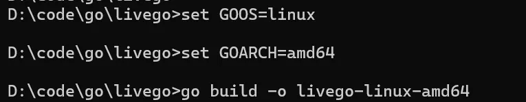


## 服务器创建livego运行目录，并上传livego-linux-amd64至该目录
`/home/go/live-go/livego`

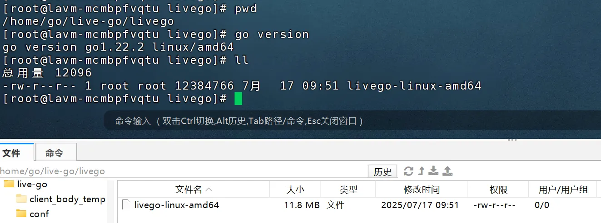


## 启动livego-linux-amd64
赋可执行权限：`chmod +x livego-linux-amd64`

运行：`./livego-linux-amd64`


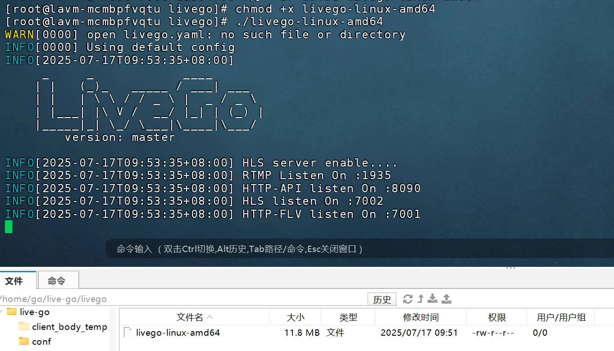


实现后台运行，日志输出到当前的logs文件夹  ：

创建日志目录：`mkdir -p logs`，

后台启动livego-linux-amd64：`nohup ./livego-linux-amd64 > logs/livego.log 2>&1 &`

输出进程 PID  方便后续停止  ：`echo $! > livego.pid`

停止命令：`kill -9 $(cat livego.pid)`

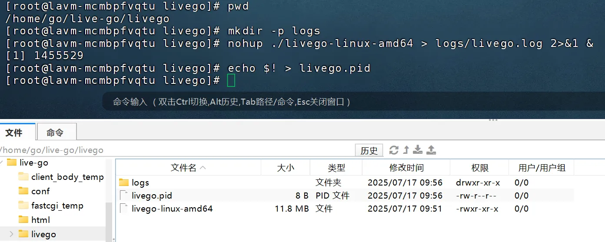


使用其他配置启动livego：`nohup ./livego-linux-amd64 -c conf/app.conf > logs/livego.log 2>&1 &`


检查livego是否可正常使用，访问：[http://117.72.xxx.xxx:8090/control/get?room=room1](http://117.72.xxx.xxx:8090/control/get?room=room1)

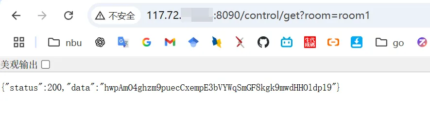


**至此，livego作为推流与拉流服务配置完成！！！**

## **至此，livego作为推流与拉流服务配置完成！！！**


# 安装ffmpeg推流工具


官网：[https://ffmpeg.org/](https://ffmpeg.org/)

开源仓库：[https://github.com/GyanD/codexffmpeg](https://github.com/GyanD/codexffmpeg)


## Windows安装ffmpeg
官网安装和GitHub源码安装二选一即可


### 官网安装
官网下载：[https://ffmpeg.org/download.html](https://ffmpeg.org/download.html)，[https://www.gyan.dev/ffmpeg/builds/](https://www.gyan.dev/ffmpeg/builds/)

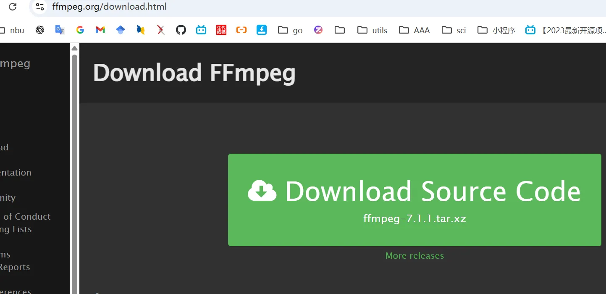


### GitHub源码安装
GitHub源码：[https://github.com/GyanD/codexffmpeg](https://github.com/GyanD/codexffmpeg)，[https://github.com/GyanD/codexffmpeg/releases/tag/2025-07-10-git-82aeee3c19](https://github.com/GyanD/codexffmpeg)

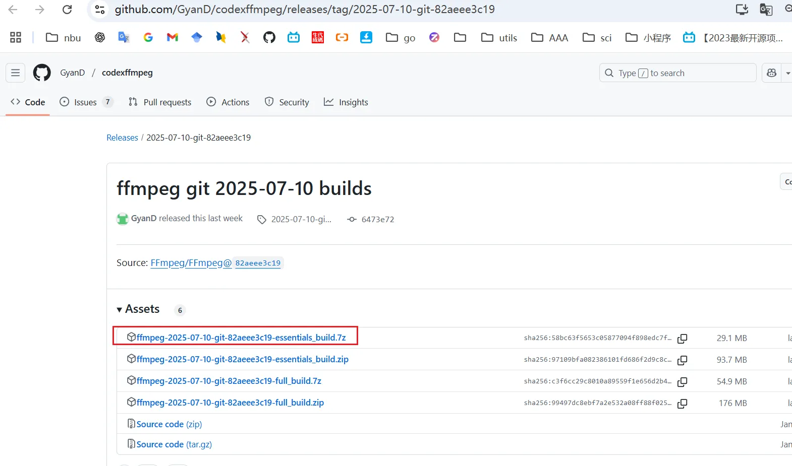


### 配置ffmpeg环境变量（本地windows）


将5.1.1或5.1.2下载下来的文件解压到指定目录：D:\develop\ffmpeg-2025-07-10-git-82aeee3c19-essentials_build

配置环境变量：D:\develop\ffmpeg-2025-07-10-git-82aeee3c19-essentials_build\ffmpeg-2025-07-10-git-82aeee3c19-essentials_build\bin


检查配置是否成功

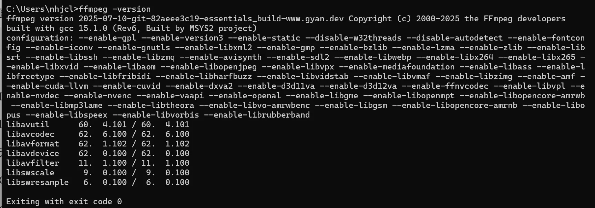


## linux-centos8安装ffmpeg
[https://ffmpeg.org/download.html#build-linux](https://ffmpeg.org/download.html#build-linux)

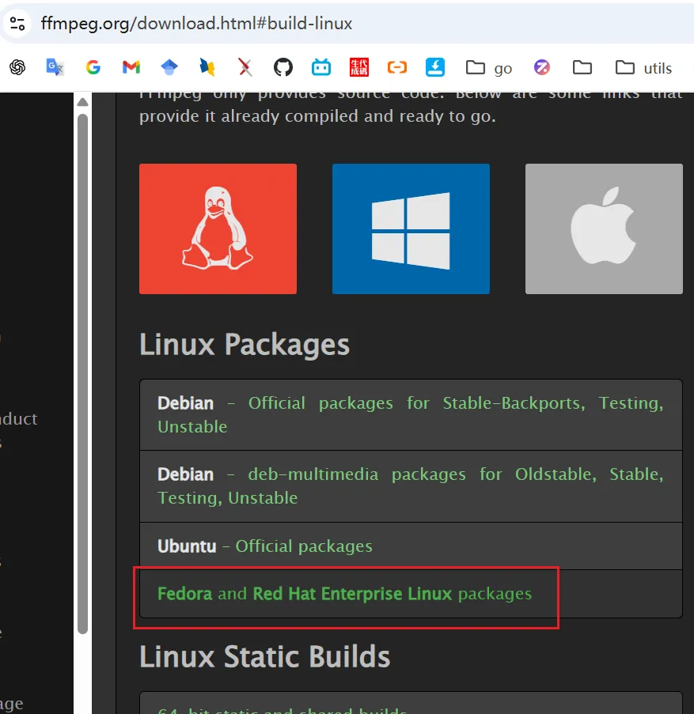


### 编译源码安装


1. 下载安装包：`wget [https://johnvansickle.com/ffmpeg/releases/ffmpeg-release-amd64-static.tar.xz](https://johnvansickle.com/ffmpeg/releases/ffmpeg-release-amd64-static.tar.xz)`
2. 解压：`tar -xvf ffmpeg-release-amd64-static.tar.xz`
3. 进入ffmpeg目录：`cd ffmpeg-7.0.2-amd64-static/`
4. 将当前目录下的 ffmpeg 可执行文件复制到 /usr/local/bin/ 目录中：`cd ffmpeg-7.0.2-amd64-static/`，这样每个位置都可以执行ffmoeg命令了
5. 验证安装是否成功：`ffmpeg -version`

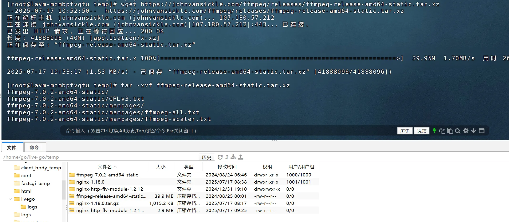


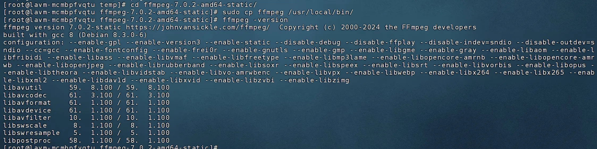


### 使用dnf命令安装
在 CentOS 8 上安装 `ffmpeg`，你应选择以下这一项：

✅ **Fedora and Red Hat Enterprise Linux packages**

因为：

+ CentOS 是基于 **Red Hat Enterprise Linux（RHEL）** 的；
+ CentOS 8 使用 `dnf` 包管理器，与 Fedora/RHEL 更兼容；
+ Debian/Ubuntu 的 `.deb` 包格式与你的系统（`.rpm`）不兼容。

---

🔧 安装 FFmpeg（CentOS 8 推荐方式）

CentOS 8 默认源没有 FFmpeg，推荐使用 **RPM Fusion** 仓库：

```yaml
# 启用 EPEL 和 RPM Fusion 源
sudo dnf install epel-release
sudo dnf install https://download1.rpmfusion.org/free/el/rpmfusion-free-release-8.noarch.rpm

# 安装 FFmpeg
sudo dnf install ffmpeg ffmpeg-devel

# 验证安装
ffmpeg -version

```


📝 可选：如果用不了 rpmfusion

你可以选择直接下载预编译的二进制（静态编译版），无需依赖系统库：

```yaml
# 下载静态版（官方推荐）
cd /usr/local/bin
curl -L -O https://johnvansickle.com/ffmpeg/releases/ffmpeg-release-i686-static.tar.xz
tar -xvf ffmpeg-release-i686-static.tar.xz
cd ffmpeg-*
cp ffmpeg ffprobe /usr/local/bin/

```


### z


# 使用ffmpeg是实现推流
## windows下推流
### 使用ffmpeg实现flv文件推流过程
[https://github.com/gwuhaolin/livego/blob/master/README_cn.md](https://github.com/gwuhaolin/livego/blob/master/README_cn.md)


1. 下载[https://github.com/gwuhaolin/livego/blob/master/README_cn.md](https://github.com/gwuhaolin/livego/blob/master/README_cn.md)里面的demo.flv示例文件
2. 生成一个房间：[http://117.72.184.xxx:8090/control/get?room=room1](http://117.72.184.xxx:8090/control/get?room=room1), 生成一个{channelkey}，直播推流的时候要用，使用ffmpeg将摄像头的流数据推入这个房间，下面的data就是{channelkey}=hwpAmO4ghzm9puecCxempE3bVYWqSmGF8kgk9mwdHHOldp19

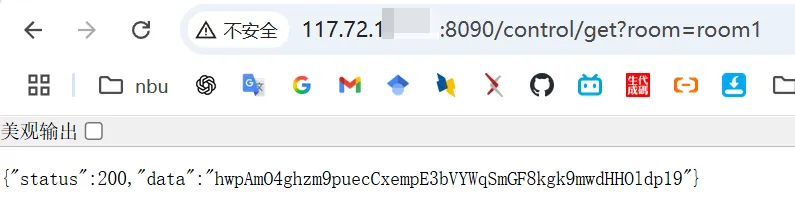


3. 本地cmd运行ffmpeg命令实现flv文件推流：`ffmpeg -re -i demo.flv -c copy -f flv rtmp://localhost:1935/{appname}/{channelkey}`，{appname}一般为live，{channelKey}由上面生成，如：`ffmpeg -re -i demo.flv -c copy -f flv rtmp://117.72.184.xxx:1935/live/hwpAmO4ghzm9puecCxempE3bVYWqSmGF8kgk9mwdHHOldp19`

如下表示在不断的往服务器推flv流

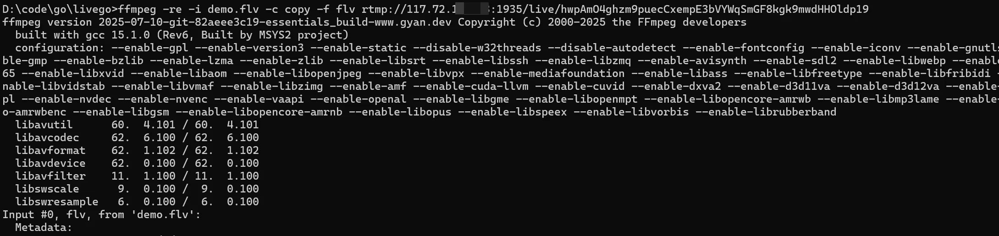


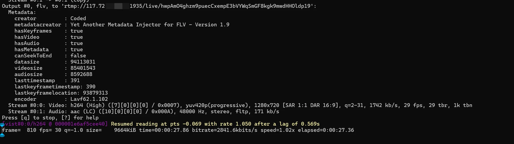


4. 访问网页：[http://117.72.184.xxx/](http://117.72.184.xxx/)，[http://117.72.184.xxx:7001/live/room1.flv](http://117.72.184.xxx:7001/live/room1.flv)

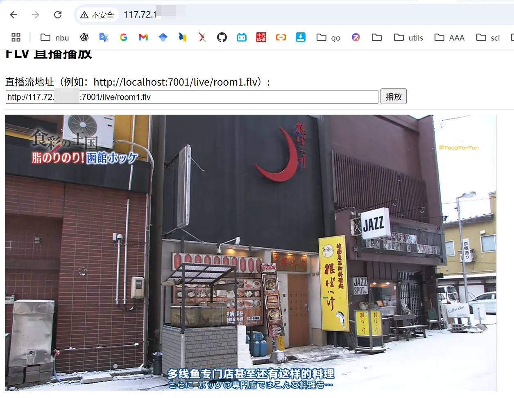


至此，windows下使用flv实现推流完成


```yaml

1. 编译livego：`go build`
2. 启动livego：`livego.exe`
3. 生成一个房间：http://localhost:8090/control/get?room=room1, 生成一个{channelkey}，直播推流的时候要用，使用ffmpeg将摄像头的流数据推入这个房间
4. 准备好一个flv文件：
5. flv文件推流：ffmpeg -re -i demo.flv -c copy -f flv rtmp://localhost:1935/{appname}/{channelkey}，{appname}一般为live，{channelKey}由第三步生成
6. 启动前端：D:\code\go\Go-Live-Streaming\live-streaming-web>npm run serve
7. 前端访问：http://localhost:7001/live/room1.flv
```

### 使用本地摄像头实现推流过程


1. 生成一个房间：[http://117.72.184.xxx:8090/control/get?room=room2](http://117.72.184.xxx:8090/control/get?room=room2), 生成一个{channelkey}，直播推流的时候要用，使用ffmpeg将摄像头的流数据推入这个房间，下面的data就是{channelkey}=9t5ZnlnkaAh55YCU0zBrlU9x0pCIfmRAmq9fxRlnnwAUGPoo

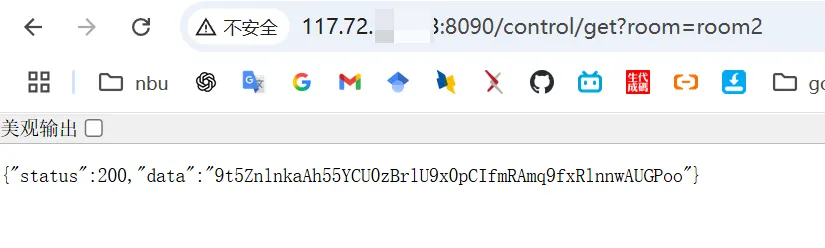


2. 查看本机支持的摄像头设备：`ffmpeg -list_devices true -f dshow -i dummy`，本地有一个"HP 5MP Camera" (video)

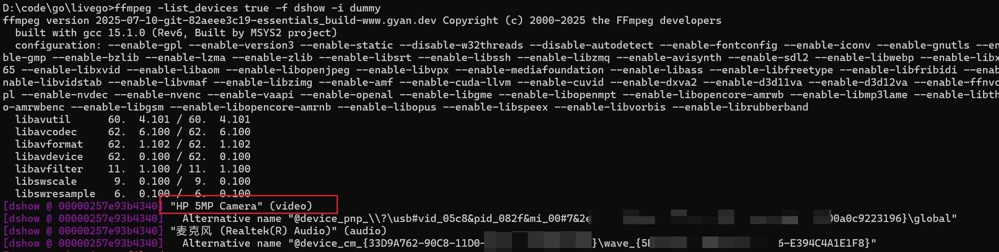


3. 摄像头推流：`ffmpeg -f dshow -thread_queue_size 512 -rtbufsize 100M -video_size 640x480 -framerate 15 -pixel_format yuyv422 -i video="HP 5MP Camera" -f lavfi -i anullsrc=channel_layout=stereo:sample_rate=44100 -c:v libx264 -preset veryfast -profile:v baseline -pix_fmt yuv420p -c:a aac -b:a 128k -g 30 -f flv rtmp://localhost:1935/live/{channelkey}`，如如如如如：`ffmpeg -f dshow -thread_queue_size 512 -rtbufsize 100M -video_size 640x480 -framerate 15 -pixel_format yuyv422 -i video="HP 5MP Camera" -f lavfi -i anullsrc=channel_layout=stereo:sample_rate=44100 -c:v libx264 -preset veryfast -profile:v baseline -pix_fmt yuv420p -c:a aac -b:a 128k -g 30 -f flv rtmp://117.72.184.xxx:1935/live/9t5ZnlnkaAh55YCU0zBrlU9x0pCIfmRAmq9fxRlnnwAUGPoo`

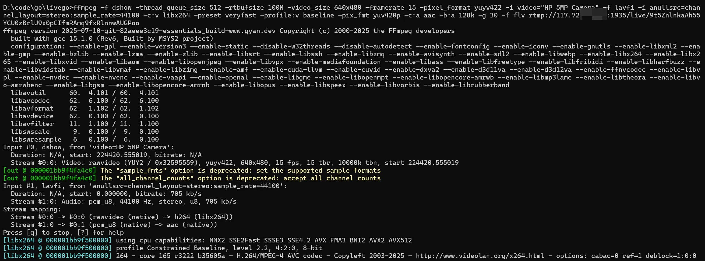


4. 访问网页：[http://117.72.184.xxx/](http://117.72.184.xxx/)，[http://117.72.184.xxx:7001/live/room2.flv](http://117.72.184.xxx:7001/live/room2.flv)

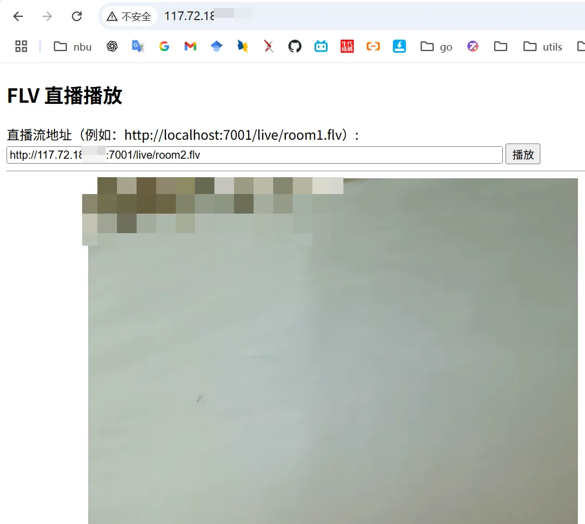


至此，windows下使用摄像头实现直播推流完成


```yaml
https://github.com/gwuhaolin/livego/blob/master/README_cn.md
1. 编译livego：go build
2. 启动livego：livego.exe
3. 生成一个房间：http://localhost:8090/control/get?room=room1, 生成一个{channelkey}，直播推流的时候要用，使用ffmpeg将摄像头的流数据推入这个房间
4. 查看当前支持的设备：ffmpeg -list_devices true -f dshow -i dummy，本地有一个"HP 5MP Camera" (video)
5. 摄像头推流：ffmpeg -f dshow -thread_queue_size 512 -rtbufsize 100M -video_size 640x480 -framerate 15 -pixel_format yuyv422 -i video="HP 5MP Camera" -f lavfi -i anullsrc=channel_layout=stereo:sample_rate=44100 -c:v libx264 -preset veryfast -profile:v baseline -pix_fmt yuv420p -c:a aac -b:a 128k -g 30 -f flv rtmp://localhost:1935/live/{channelkey}
6. 启动前端：D:\code\go\Go-Live-Streaming\live-streaming-web>npm run serve
7. 前端访问：http://localhost:7001/live/room1.flv
```


## Linux下推流


### 使用ffmpeg实现flv文件推流过程
[https://github.com/gwuhaolin/livego/blob/master/README_cn.md](https://github.com/gwuhaolin/livego/blob/master/README_cn.md)


1. 下载[https://github.com/gwuhaolin/livego/blob/master/README_cn.md](https://github.com/gwuhaolin/livego/blob/master/README_cn.md)里面的demo.flv示例文件到`/home/go/live-go/livego`目录，执行：`wget '[https://s3plus.meituan.net/v1/mss_7e425c4d9dcb4bb4918bbfa2779e6de1/mpack/default/demo.flv'](https://s3plus.meituan.net/v1/mss_7e425c4d9dcb4bb4918bbfa2779e6de1/mpack/default/demo.flv')`

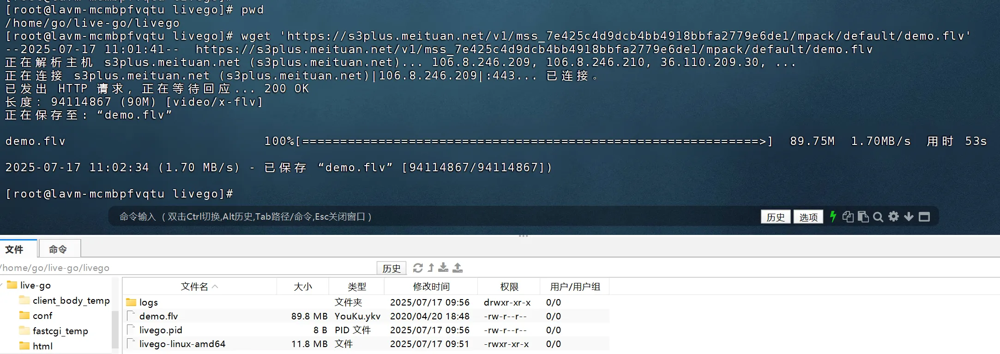


2. 生成一个房间：[http://117.72.184.xxx:8090/control/get?room=room21](http://117.72.184.xxx:8090/control/get?room=room21), 生成一个{channelkey}，直播推流的时候要用，使用ffmpeg将摄像头的流数据推入这个房间，下面的data就是{channelkey}=5AoXnTeA2uZRJILnhbRXLtQM8PLS1IdEaelntU0kyRAQ9I7C

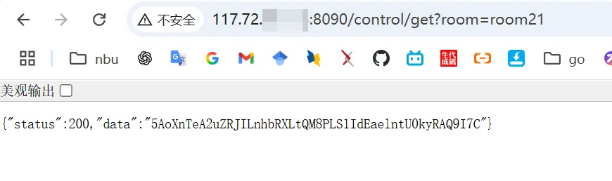


3. `/home/go/live-go/livego`下运行ffmpeg命令实现flv文件推流：`ffmpeg -re -i demo.flv -c copy -f flv rtmp://localhost:1935/{appname}/{channelkey}`，{appname}一般为live，{channelKey}由上面生成，如：`ffmpeg -re -i demo.flv -c copy -f flv rtmp://117.72.184.xxx:1935/live/5AoXnTeA2uZRJILnhbRXLtQM8PLS1IdEaelntU0kyRAQ9I7C`

如下表示在不断的往服务器推flv流

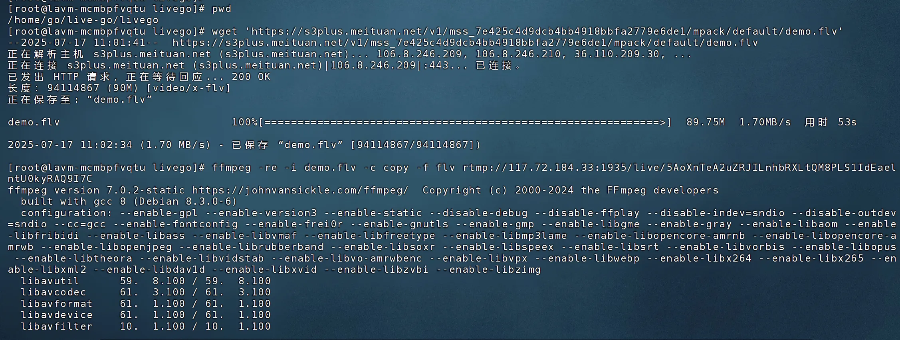


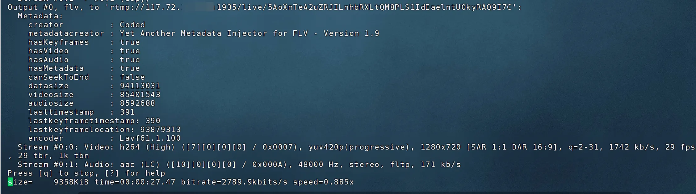


4. 访问网页：[http://117.72.184.xxx/](http://117.72.184.xxx/)，[http://117.72.184.xxx:7001/live/room21.flv](http://117.72.184.xxx:7001/live/room21.flv)

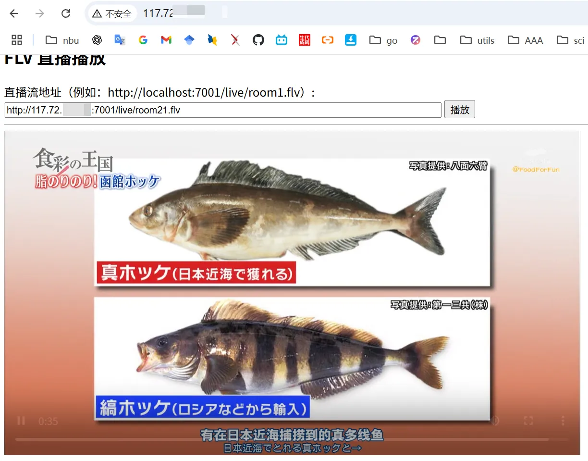


### 使用本地摄像头实现推流过程【【【待完成】】】


[https://github.com/ossrs/srs](https://github.com/ossrs/srs)【重点】

[https://github.com/steveseguin/vdo.ninja](https://github.com/steveseguin/vdo.ninja)


1. 生成一个房间：[http://117.72.184.xxx:8090/control/get?room=room22](http://117.72.184.xxx:8090/control/get?room=room22), 生成一个{channelkey}，直播推流的时候要用，使用ffmpeg将摄像头的流数据推入这个房间，下面的data就是{channelkey}=YQ9KjHuYVybjISGYUnhLGquIVn46m41gsgqoTfHexDR8yQrp

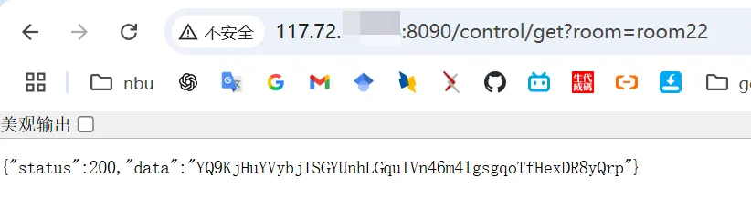


2. z：`rtmp://117.72.184.xxx:1935/live/YQ9KjHuYVybjISGYUnhLGquIVn46m41gsgqoTfHexDR8yQrp`
3. 访问网页：[http://117.72.184.xxx/](http://117.72.184.xxx/)，[http://117.72.184.xxx:7001/live/room22.flv](http://117.72.184.xxx:7001/live/room22.flv)


至此，windows下使用摄像头实现直播推流完成


4. z
5. 摄像头推流：`ffmpeg -f dshow -thread_queue_size 512 -rtbufsize 100M -video_size 640x480 -framerate 15 -pixel_format yuyv422 -i video="HP 5MP Camera" -f lavfi -i anullsrc=channel_layout=stereo:sample_rate=44100 -c:v libx264 -preset veryfast -profile:v baseline -pix_fmt yuv420p -c:a aac -b:a 128k -g 30 -f flv rtmp://localhost:1935/live/{channelkey}`，如如如如如：`ffmpeg -f dshow -thread_queue_size 512 -rtbufsize 100M -video_size 640x480 -framerate 15 -pixel_format yuyv422 -i video="HP 5MP Camera" -f lavfi -i anullsrc=channel_layout=stereo:sample_rate=44100 -c:v libx264 -preset veryfast -profile:v baseline -pix_fmt yuv420p -c:a aac -b:a 128k -g 30 -f flv rtmp://117.72.184.xxx:1935/live/9t5ZnlnkaAh55YCU0zBrlU9x0pCIfmRAmq9fxRlnnwAUGPoo`


1.


# 其他


## srs和livego对比
[https://github.com/ossrs/srs](https://github.com/ossrs/srs)，[https://ossrs.io/lts/en-us/](https://ossrs.io/lts/en-us/)

[https://github.com/gwuhaolin/livego](https://github.com/gwuhaolin/livego)

| 功能/特性 | **SRS** | **LiveGo** |
| --- | --- | --- |
| 推流协议支持 | RTMP / SRT / WebRTC / HLS / HTTP-FLV / GB28181 | 主要支持 RTMP 推流、HTTP-FLV 播放 |
| 播放协议支持 | HLS、HTTP-FLV、WebRTC 等 | HTTP-FLV、HLS（较弱） |
| 录制 | ✅（支持 RTMP/FLV/MP4） | ✅（支持但配置较少） |
| 延迟优化 | ✅（WebRTC 超低延迟支持） | ❌（常规 RTMP 延迟） |
| 推流鉴权 | ✅（支持多种鉴权机制） | ✅（支持简单 token 鉴权） |
| 多用户/虚拟主机支持 | ✅ | ❌（不支持虚拟主机） |
| Web 推流 | ✅（网页推流支持） | ❌（需结合 FFmpeg/OBS） |
| 社区活跃度 | 非常活跃，Star 数 > 20k+ | 活跃度低，Star 数 ~6k |
| 文档支持 | ✅（官方文档齐全、中英文） | 一般，主要是 README 和 Issue |
| 性能 | 高性能，支持高并发（万级连接） | 中低性能，适合单机测试 |
| Docker 镜像 | ✅ 官方提供 | ✅ 非官方 |
| 安装/部署 | 简单（支持容器/二进制/源码） | 简单（二进制或源码） |


🔧 使用建议：

✅ 推荐使用 SRS 的场景：

+ 要构建一个稳定、完整功能的 **生产级直播系统**
+ 需要 **支持 WebRTC、SRT、低延迟** 等现代协议
+ 要做 **网页推流、推送到 CDN、多终端兼容播放**
+ 希望部署在云上（如 Kubernetes + Docker）


👍 推荐使用 LiveGo 的场景：

+ 学习直播协议（RTMP、FLV）的基本原理
+ 想快速本地测试“推流+播放”
+ 用于内网、小型演示环境，不考虑高并发


# z


