nginx-http-flv-moduleæ­å»ºä»0到1å®ç°ç›´æ’­æ¨æµ


https://www.yuque.com/nhjclxc/clq5m5/dhc9tt9g836yxg4z?singleDoc# 《nginx-http-flv-moduleæ­å»ºä»0到1å®ç°ç›´æ’­æ¨æµã€‹


所有æºç å¯è®¿é—®ï¼š[https://github.com/nhjclxc/Go-Live-Streaming](https://github.com/nhjclxc/Go-Live-Streaming)


# 安装包准备
1. nginx安装包：[https://nginx.org/download/nginx-1.18.0.tar.gz](https://nginx.org/download/nginx-1.18.0.tar.gz)
2. nginxçš„http-flv模å—：[https://github.com/winshining/nginx-http-flv-module](https://github.com/winshining/nginx-http-flv-module)
3. ã€å…¶ä»–的，这个å¯é€‰ï¼Œå¦‚æœé€‰æ‹©è¿™ä¸ªé‚£ä¹ˆå°±æ— æ³•å®ç°http-flv】nginxçš„rtmp模å—：[https://github.com/arut/nginx-rtmp-module](https://github.com/arut/nginx-rtmp-module)，[https://github.com/arut/nginx-rtmp-module/releases/tag/v1.2.2](https://github.com/arut/nginx-rtmp-module/releases/tag/v1.2.2)


✅ è§£å†³æ–¹æ¡ˆï¼šä½¿ç”¨åŒ…å« HTTP-FLV çš„ nginx-rtmp 模å—

✅ 方法 1ï¼šç¡®è®¤ä½ ä½¿ç”¨çš„æ˜¯æ”¯æŒ `flv_live` 的版本（如 [winshining/nginx-http-flv-module](https://github.com/winshining/nginx-http-flv-module)）

标准的 `nginx-rtmp-module`（arut 版）åªæ”¯æŒ RTMP å’Œ HLS，ä¸æ”¯æŒ `flv_live`。  
你需è¦æ¢æˆ `**nginx-http-flv-module**`（由 `winshining` æ供），它æ‰æ”¯æŒ `flv_live`。


是的，✅ `**nginx-http-flv-module**`** 完全å¯ä»¥ä½œä¸º RTMP æ¨æµ+拉æµä¸­å¿ƒ**，并且æä¾›é¢å¤–çš„ **HTTP-FLVã€HLSã€API 状æ€æ¥å£**，比标准 `nginx-rtmp-module` 更适åˆç°ä»£ç›´æ’­éœ€æ±‚。


| 能力 | `nginx-http-flv-module`<br/>（winshining） | `nginx-rtmp-module`<br/>（arut） |
| --- | --- | --- |
| RTMP æ¨æµ/æ‹‰æµ | ✅ æ”¯æŒ | ✅ æ”¯æŒ |
| HTTP-FLV 直播播放 | ✅ 支æŒï¼ˆé€šè¿‡ `flv_live on`<br/>） | ⌠ä¸æ”¯æŒ |
| HLS 直播播放 | ✅ 支æŒï¼ˆ`hls on`<br/>） | ✅ æ”¯æŒ |
| API æ¥å£ï¼ˆç»Ÿè®¡æµä¿¡æ¯ï¼‰ | ✅ æ”¯æŒ `/stat`<br/>, `/control`<br/> ç­‰ | ✅ 支æŒï¼ˆæ ·å¼ä¸åŒï¼‰ |
| å¤šè·¯åº”ç”¨ç®¡ç† | ✅ 支æŒå¤šä¸ª application | ✅ æ”¯æŒ |
| 较活跃维护 | ✅ 是 | ⌠维护较少 |
| å®æ—¶æ€§ & 稳定性 | ✅ 好 | ✅ 好 |


✅ æ¨æµ+拉æµå·¥ä½œæµç¨‹ç¤ºæ„：

```yaml
[OBS/FFmpeg æ¨æµ] ---> nginx-http-flv-module (RTMP)

[RTMP 拉æµ] ---> 播放器 (VLC / FFmpeg)
[HTTP-FLV 拉æµ] ---> flv.js æµè§ˆå™¨æ’­æ”¾å™¨
[HLS 拉æµ] ---> hls.js / Safari

```


---

✅ 是å¦æ”¯æŒæ¨æ‹‰ä¸­è½¬ï¼Ÿ

是的，å¯ä»¥é€šè¿‡é…ç½® `relay` 机制å®ç°â€œä¸­è½¬â€åŠŸèƒ½ï¼Œä¾‹å¦‚：

```plain
application forward {
    live on;
    pull rtmp://other-source-ip/live name=room1 static;
}
```

或：

```plain
push rtmp://another-server/live;
```

但 relay 主è¦ç”± `nginx-rtmp-module` æ供，`nginx-http-flv-module` 也å¯ä»¥ä½¿ç”¨ relay，但需è¦æ­é…正确版本（它是å‘å兼容的）。


# 安装编译工具ä¾èµ–
`sudo dnf install gcc make pcre pcre-devel openssl openssl-devel`

# 安装nginx-http-flvç›´æ’­æ¨æµä¸æ‹‰æµçš„中转节点


## 将1中下载的两个安装包上传至：`/home/go/live-go/temp`


## 命令行进入：`/home/go/live-go/temp`


## 安装nginx
1. 首先在**/home/go/live-go/temp**目录执行：`tar -zxvf nginx-1.18.0.tar.gz `解å‹nginx
2. æ¥ç€è§£å‹**nginx-http-flv-module**，执行：`tar -zxvf nginx-http-flv-module-1.2.12.tar.gz`
3. ç¡®ä¿è§£å‹å‡ºæ¥çš„**nginx-1.18.0**文件夹ä¸è§£å‹å‡ºæ¥çš„**nginx-http-flv-module-1.2.12**文件夹在åŒä¸€ä¸ªç›®å½•ä¸‹

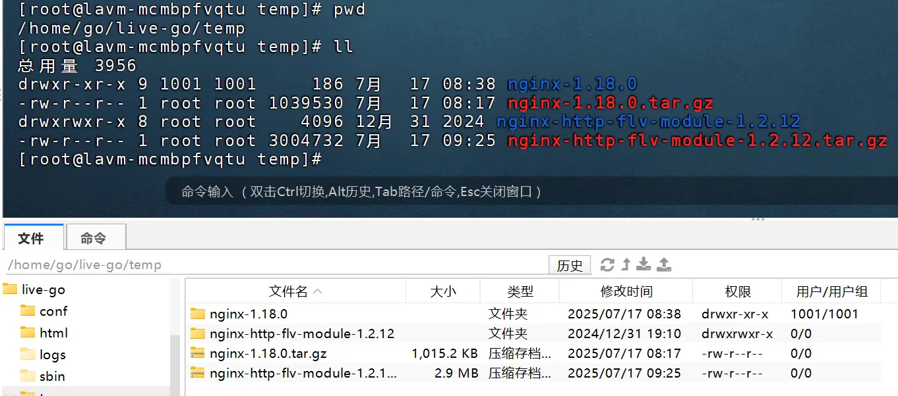


4. 编译nginx，先进入**/home/go/live-go/temp/nginx-1.18.0**目录，æ¥ç€æ‰§è¡Œå‘½ä»¤ï¼š`./configure --prefix=/home/go/live-go  --add-module=../nginx-http-flv-module-1.2.12  --with-http_ssl_module`（`/home/go/live-go`是nginx最å安装目录，`../nginx-http-flv-module-1.2.12`çš„æ„æ€æ˜¯å®‰è£…这个nginx的时候å»åŠ è½½nginx-rtmp这个模å—，`..`表示上一级目录下的nginx-http-flv-module-1.2.12）

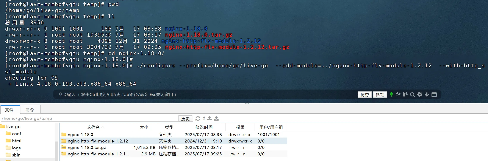


5. 安装nginx：在当å‰ç›®å½•æ‰§è¡Œï¼š`make install`

在目标目录下出ç°äº†ï¼šconfã€htmlã€logsã€sbin等目录

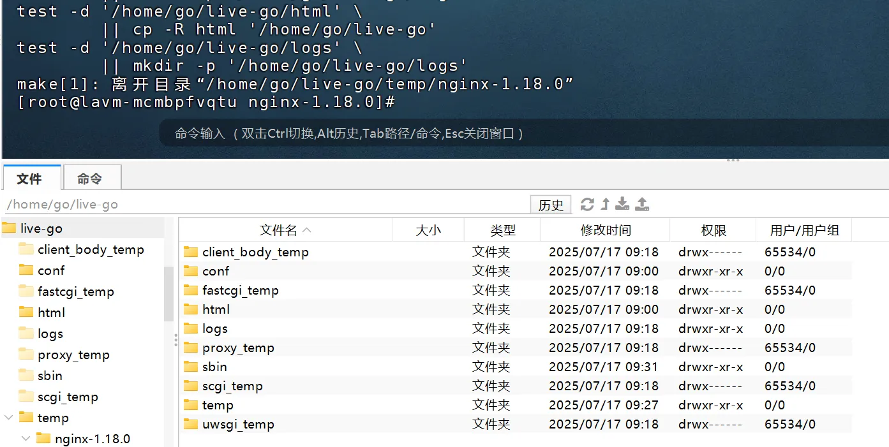


6. 编写nginx.confã€ç›®å‰ä»…支æŒflv】

```yaml
worker_processes  1;

events {
    worker_connections  1024;
}

http {
    include       mime.types;
    default_type  application/octet-stream;

    sendfile        on;
    keepalive_timeout  65;

    # 支æŒè·¨åŸŸè®¿é—®ï¼ˆflv.js 需è¦ï¼‰
    add_header 'Access-Control-Allow-Origin' '*' always;
    add_header 'Access-Control-Expose-Headers' 'Content-Length,Content-Range' always;

    server {
        # livego使用7001å®ç°HTTP-FLV的拉æµã€æ¨æµ
        listen       7001;
        server_name  localhost;

        # ç”¨äº flv.js 播放的 HTTP-FLV æµè·¯å¾„：
        # 播放地å€ï¼šhttp://localhost:7001/live/room1.flv
        location /live {
            flv_live on;         # å¼€å¯ HTTP-FLV
            chunked_transfer_encoding on;  # 使用 chunked ç¼–ç ä¼ è¾“
            add_header 'Cache-Control' 'no-cache';
            add_header 'Access-Control-Allow-Origin' '*';
            add_header 'Access-Control-Allow-Credentials' 'true';
        }

        # å¯é€‰ï¼šç”¨äºæµ‹è¯•çš„é™æ€æ’­æ”¾é¡µé¢ï¼ˆindex.html）
        location / {
            root /home/go/live-go/html;
            index index.html;
        }
    }
}

rtmp {
    server {
        # livego使用7001å®ç° RTMP 的拉æµã€æ¨æµ
        listen 1935;
        chunk_size 4096;

        application live {
            live on;
            record off;

            # å¯é€‰ï¼šHLS åŒæ—¶å¼€å¯
            # hls on;
            # hls_path /tmp/hls;
            # hls_fragment 3;
            # hls_playlist_length 10;
        }
    }
}

```

7. 编写拉æµç›´æ’­index.html页é¢ï¼Œå¹¶å°†æ”¹æ–‡ä»¶ä¸Šä¼ åˆ°**/home/go/live-go/html**目录

```html
<!DOCTYPE html>
<html lang="zh">
<head>
    <meta charset="UTF-8">
    <title>FLV Live 播放器</title>
    <script src="https://cdn.jsdelivr.net/npm/flv.js@latest/dist/flv.min.js"></script>
</head>
<body>
<h2>FLV 直播播放</h2>

<label for="streamUrl">ç›´æ’­æµåœ°å€ï¼ˆä¾‹å¦‚：http://localhost:7001/live/room1.flv）:</label><br>
<input type="text" id="streamUrl" value="http://localhost:7001/live/room1.flv" style="width: 600px;">
<button onclick="startPlay()">播放</button>

<hr>

<video id="videoElement" controls autoplay style="width: 800px; height: 450px;"></video>

<script>
    let player;

    function startPlay() {
        const url = document.getElementById("streamUrl").value.trim();
        const videoElement = document.getElementById("videoElement");

        // 销æ¯æ—§çš„ player å®ä¾‹
        if (player) {
            player.destroy();
            player = null;
        }

        if (flvjs.isSupported()) {
            player = flvjs.createPlayer({
                type: 'flv',
                url: url
            });

            player.attachMediaElement(videoElement);
            player.load();
            player.play();
        } else {
            alert("当å‰æµè§ˆå™¨ä¸æ”¯æŒ flv.js 播放ï¼");
        }
    }
</script>
</body>
</html>

```

8. å¯åŠ¨nginx：`/home/go/live-go/sbin/nginx -p /home/go/live-go/ -c conf/nginx.conf`

é‡å¯ä½¿ç”¨ï¼š`/home/go/live-go/sbin/nginx -s reload`

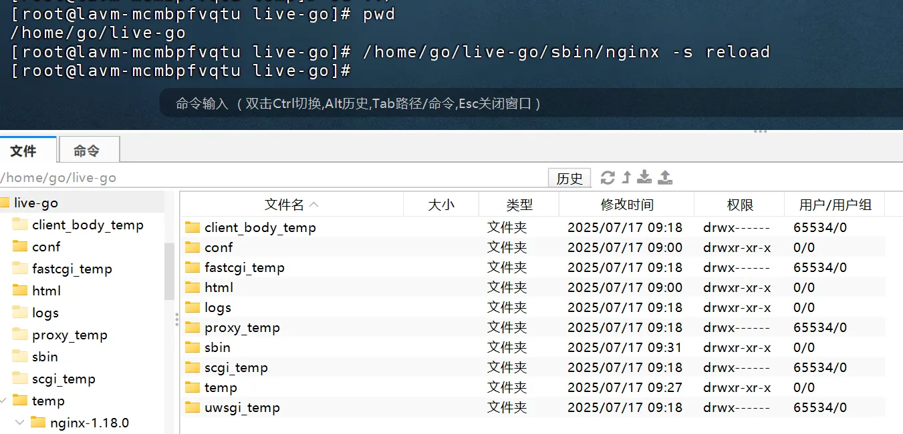


9. 访问页é¢

[http://117.72.xxx.xxx/](http://117.72.xxx.xxx/)

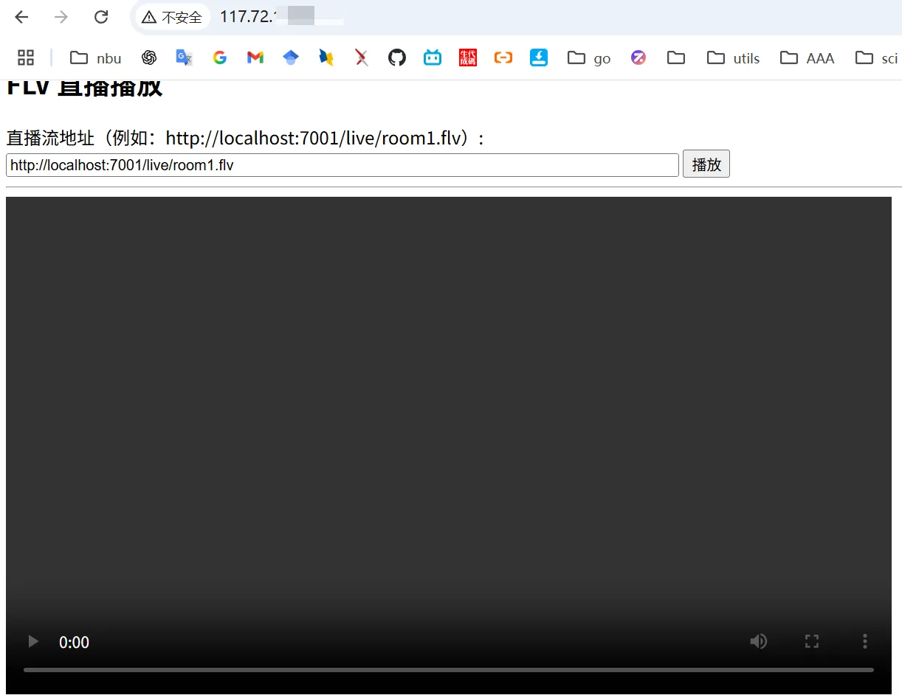


10. è‡³æ­¤ï¼ŒåŸºäº nginx-http-flv-module 模å—çš„ nginx å·²é…置完æˆï¼Œå¯ä½œä¸ºç›´æ’­æ¨æµä¸æ‹‰æµçš„中转节点。æ¥ä¸‹æ¥å°†ä½¿ç”¨ Go 语言的 LiveGo（[github.com/gwuhaolin/livego](https://github.com/gwuhaolin/livego)）框æ¶å®ç°æ¨æµä¸æ‹‰æµæœåŠ¡ã€‚


## z


# 安装livegoå®ç°æ¨æµä¸æ‹‰æµæœåŠ¡
使用 LiveGo（[https://github.com/gwuhaolin/livego](https://github.com/gwuhaolin/livego)ï¼‰æ¡†æ¶ å®ç°æ¨æµä¸æ‹‰æµæœåŠ¡


## git clone克隆livego项目
D:\code\go\livego>执行：`git clone [https://github.com/gwuhaolin/livego](https://github.com/gwuhaolin/livego)`


## 本地（Windows）编译Linuxç¯å¢ƒä¸‹çš„livegoå¯æ‰§è¡Œæ–‡ä»¶
`D:\code\go\livego>set GOOS=linux`

`D:\code\go\livego>set GOARCH=amd64`

`D:\code\go\livego>go build -o livego-linux-amd64`


## æœåŠ¡å™¨åˆ›å»ºlivegoè¿è¡Œç›®å½•ï¼Œå¹¶ä¸Šä¼ livego-linux-amd64至该目录
`/home/go/live-go/livego`

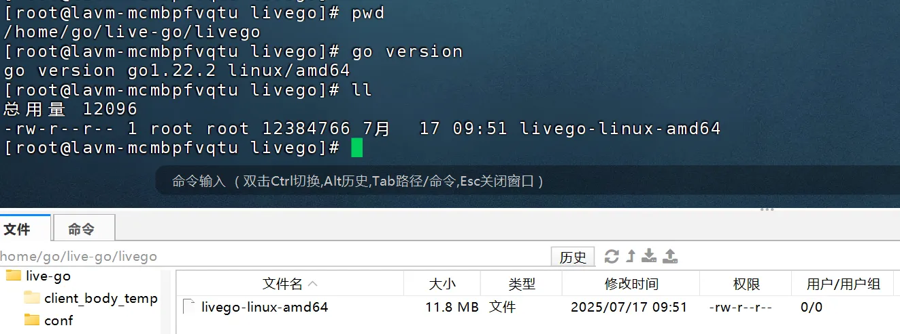


## å¯åŠ¨livego-linux-amd64
赋å¯æ‰§è¡Œæƒé™ï¼š`chmod +x livego-linux-amd64`

è¿è¡Œï¼š`./livego-linux-amd64`


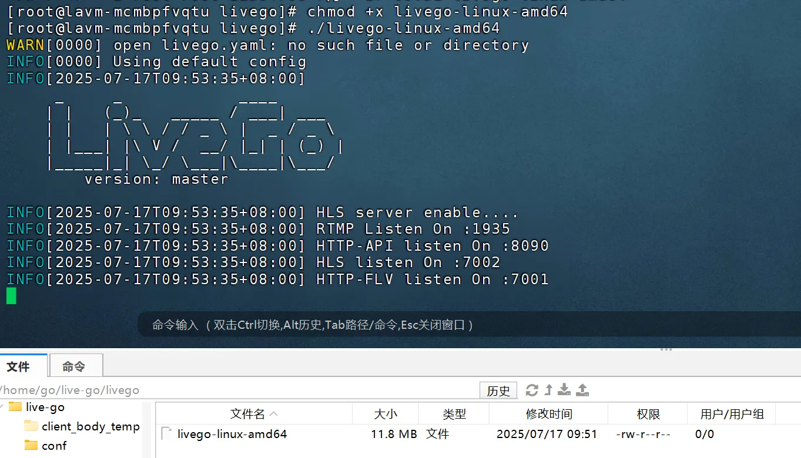


å®ç°åå°è¿è¡Œï¼Œæ—¥å¿—输出到当å‰çš„logs文件夹  ：

创建日志目录：`mkdir -p logs`，

åå°å¯åŠ¨livego-linux-amd64：`nohup ./livego-linux-amd64 > logs/livego.log 2>&1 &`

输出进程 PID  方便åç»­åœæ­¢  ：`echo $! > livego.pid`

åœæ­¢å‘½ä»¤ï¼š`kill -9 $(cat livego.pid)`

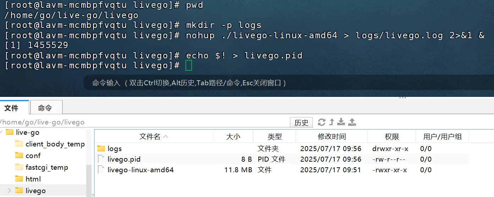


使用其他é…ç½®å¯åŠ¨livego：`nohup ./livego-linux-amd64 -c conf/app.conf > logs/livego.log 2>&1 &`


检查livego是å¦å¯æ­£å¸¸ä½¿ç”¨ï¼Œè®¿é—®ï¼š[http://117.72.xxx.xxx:8090/control/get?room=room1](http://117.72.xxx.xxx:8090/control/get?room=room1)

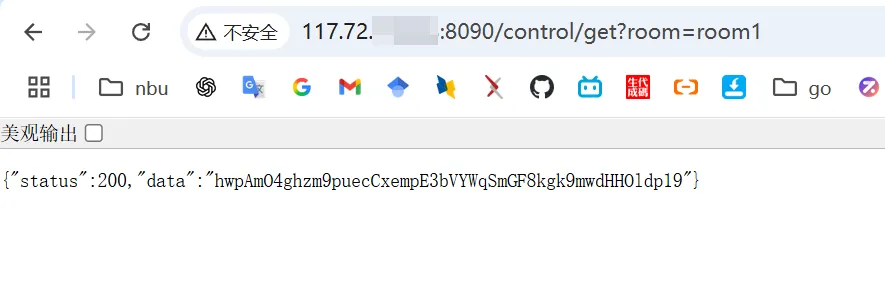


**至此，livego作为æ¨æµä¸æ‹‰æµæœåŠ¡é…置完æˆï¼ï¼ï¼**

## **至此，livego作为æ¨æµä¸æ‹‰æµæœåŠ¡é…置完æˆï¼ï¼ï¼**


# 安装ffmpegæ¨æµå·¥å…·


官网：[https://ffmpeg.org/](https://ffmpeg.org/)

å¼€æºä»“库：[https://github.com/GyanD/codexffmpeg](https://github.com/GyanD/codexffmpeg)


## Windows安装ffmpeg
官网安装和GitHubæºç å®‰è£…二选一å³å¯


### 官网安装
官网下载：[https://ffmpeg.org/download.html](https://ffmpeg.org/download.html)，[https://www.gyan.dev/ffmpeg/builds/](https://www.gyan.dev/ffmpeg/builds/)

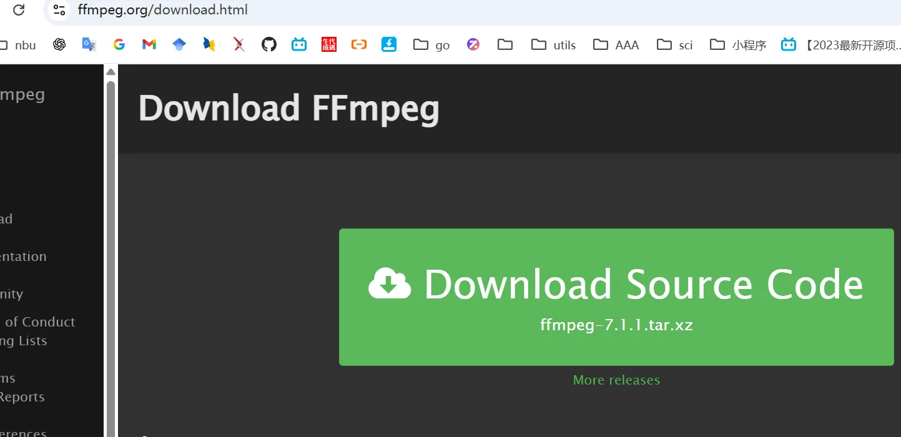


### GitHubæºç å®‰è£…
GitHubæºç ï¼š[https://github.com/GyanD/codexffmpeg](https://github.com/GyanD/codexffmpeg)，[https://github.com/GyanD/codexffmpeg/releases/tag/2025-07-10-git-82aeee3c19](https://github.com/GyanD/codexffmpeg)

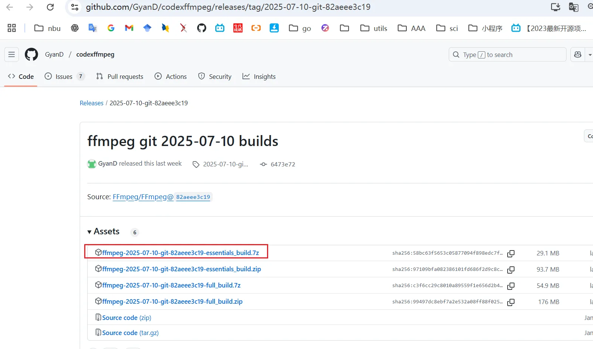


### é…ç½®ffmpegç¯å¢ƒå˜é‡ï¼ˆæœ¬åœ°windows）


å°†5.1.1或5.1.2下载下æ¥çš„文件解å‹åˆ°æŒ‡å®šç›®å½•ï¼šD:\develop\ffmpeg-2025-07-10-git-82aeee3c19-essentials_build

é…ç½®ç¯å¢ƒå˜é‡ï¼šD:\develop\ffmpeg-2025-07-10-git-82aeee3c19-essentials_build\ffmpeg-2025-07-10-git-82aeee3c19-essentials_build\bin

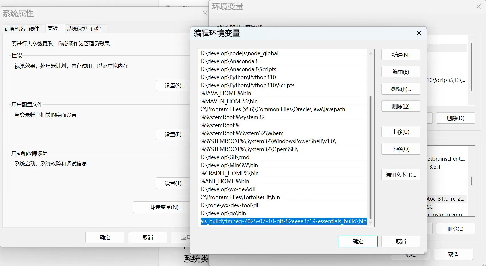


检查é…置是å¦æˆåŠŸ

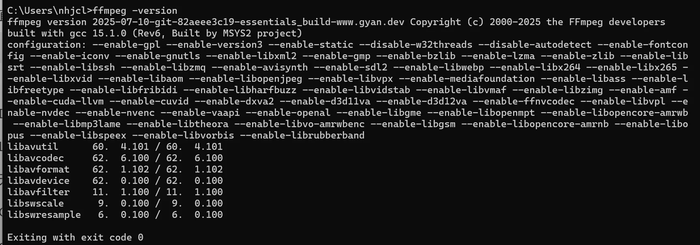


## linux-centos8安装ffmpeg
[https://ffmpeg.org/download.html#build-linux](https://ffmpeg.org/download.html#build-linux)

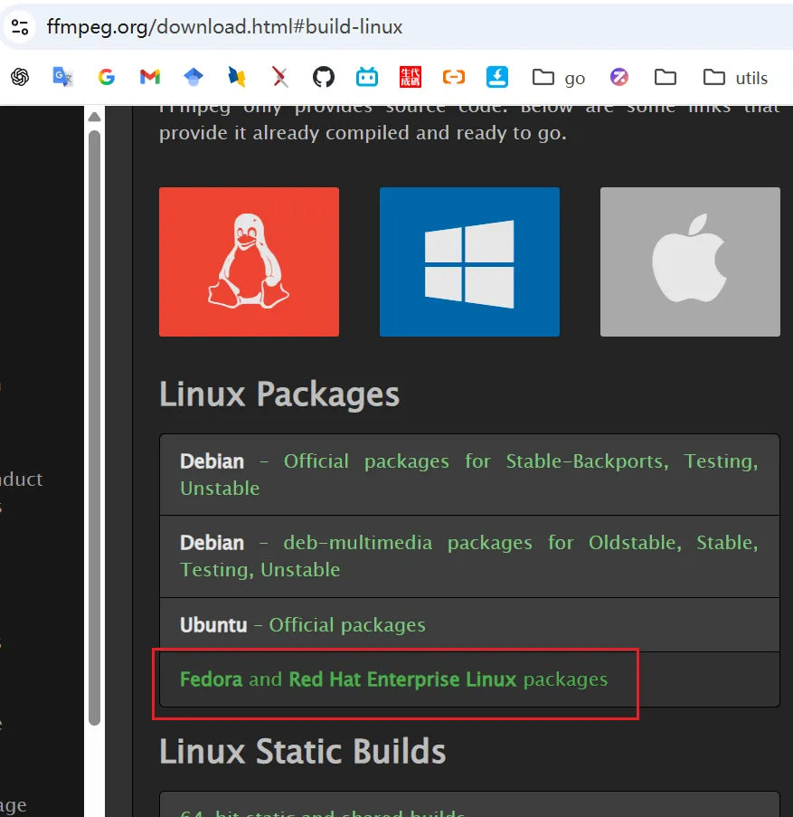


### 编译æºç å®‰è£…


1. 下载安装包：`wget [https://johnvansickle.com/ffmpeg/releases/ffmpeg-release-amd64-static.tar.xz](https://johnvansickle.com/ffmpeg/releases/ffmpeg-release-amd64-static.tar.xz)`
2. 解å‹ï¼š`tar -xvf ffmpeg-release-amd64-static.tar.xz`
3. 进入ffmpeg目录：`cd ffmpeg-7.0.2-amd64-static/`
4. 将当å‰ç›®å½•ä¸‹çš„ ffmpeg å¯æ‰§è¡Œæ–‡ä»¶å¤åˆ¶åˆ° /usr/local/bin/ 目录中：`cd ffmpeg-7.0.2-amd64-static/`，这样æ¯ä¸ªä½ç½®éƒ½å¯ä»¥æ‰§è¡Œffmoeg命令了
5. 验è¯å®‰è£…是å¦æˆåŠŸï¼š`ffmpeg -version`

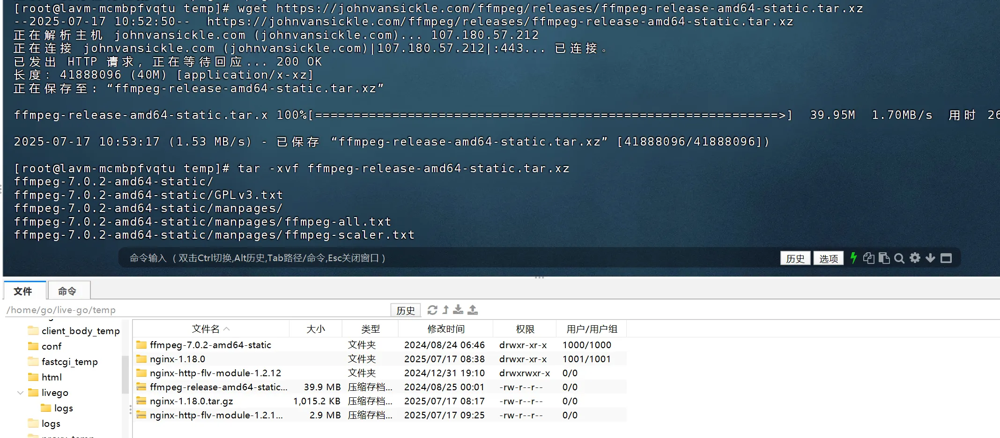


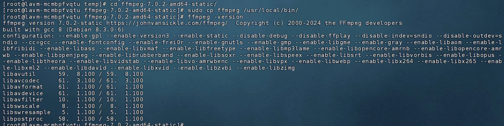


### 使用dnf命令安装
在 CentOS 8 上安装 `ffmpeg`，你应选择以下这一项：

✅ **Fedora and Red Hat Enterprise Linux packages**

因为：

+ CentOS æ˜¯åŸºäº **Red Hat Enterprise Linux（RHEL）** çš„ï¼›
+ CentOS 8 使用 `dnf` 包管ç†å™¨ï¼Œä¸ Fedora/RHEL 更兼容；
+ Debian/Ubuntu çš„ `.deb` 包格å¼ä¸ä½ çš„系统（`.rpm`）ä¸å…¼å®¹ã€‚

---

🔧 安装 FFmpeg（CentOS 8 æ¨èæ–¹å¼ï¼‰

CentOS 8 默认æºæ²¡æœ‰ FFmpeg，æ¨è使用 **RPM Fusion** 仓库：

```yaml
# å¯ç”¨ EPEL å’Œ RPM Fusion æº
sudo dnf install epel-release
sudo dnf install https://download1.rpmfusion.org/free/el/rpmfusion-free-release-8.noarch.rpm

# 安装 FFmpeg
sudo dnf install ffmpeg ffmpeg-devel

# 验è¯å®‰è£…
ffmpeg -version

```


📠å¯é€‰ï¼šå¦‚æœç”¨ä¸äº† rpmfusion

ä½ å¯ä»¥é€‰æ‹©ç›´æ¥ä¸‹è½½é¢„编译的二进制（é™æ€ç¼–译版），无需ä¾èµ–系统库：

```yaml
# 下载é™æ€ç‰ˆï¼ˆå®˜æ–¹æ¨è）
cd /usr/local/bin
curl -L -O https://johnvansickle.com/ffmpeg/releases/ffmpeg-release-i686-static.tar.xz
tar -xvf ffmpeg-release-i686-static.tar.xz
cd ffmpeg-*
cp ffmpeg ffprobe /usr/local/bin/

```


### z


# 使用ffmpeg是å®ç°æ¨æµ
## windows下æ¨æµ
### 使用ffmpegå®ç°flv文件æ¨æµè¿‡ç¨‹
[https://github.com/gwuhaolin/livego/blob/master/README_cn.md](https://github.com/gwuhaolin/livego/blob/master/README_cn.md)


1. 下载[https://github.com/gwuhaolin/livego/blob/master/README_cn.md](https://github.com/gwuhaolin/livego/blob/master/README_cn.md)里é¢çš„demo.flv示例文件
2. 生æˆä¸€ä¸ªæˆ¿é—´ï¼š[http://117.72.184.xxx:8090/control/get?room=room1](http://117.72.184.xxx:8090/control/get?room=room1), 生æˆä¸€ä¸ª{channelkey}，直播æ¨æµçš„时候è¦ç”¨ï¼Œä½¿ç”¨ffmpeg将摄åƒå¤´çš„æµæ•°æ®æ¨å…¥è¿™ä¸ªæˆ¿é—´ï¼Œä¸‹é¢çš„data就是{channelkey}=hwpAmO4ghzm9puecCxempE3bVYWqSmGF8kgk9mwdHHOldp19

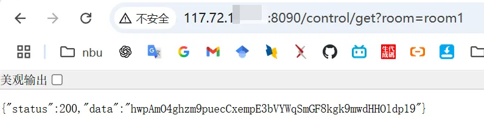


3. 本地cmdè¿è¡Œffmpeg命令å®ç°flv文件æ¨æµï¼š`ffmpeg -re -i demo.flv -c copy -f flv rtmp://localhost:1935/{appname}/{channelkey}`，{appname}一般为live，{channelKey}由上é¢ç”Ÿæˆï¼Œå¦‚：`ffmpeg -re -i demo.flv -c copy -f flv rtmp://117.72.184.xxx:1935/live/hwpAmO4ghzm9puecCxempE3bVYWqSmGF8kgk9mwdHHOldp19`

如下表示在ä¸æ–­çš„å¾€æœåŠ¡å™¨æ¨flvæµ

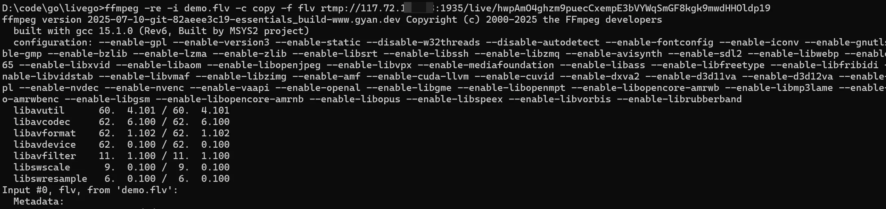


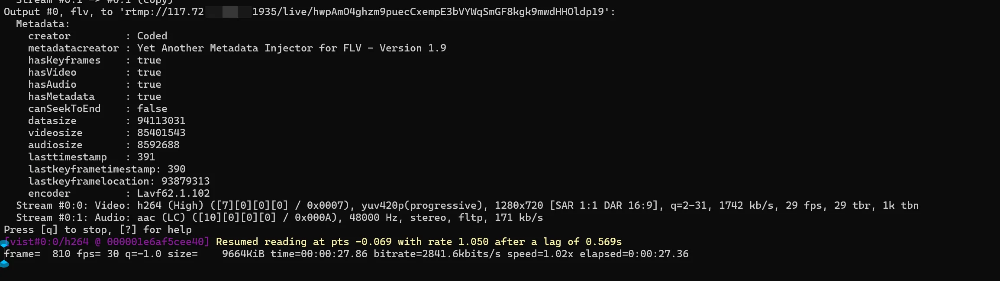


4. 访问网页：[http://117.72.184.xxx/](http://117.72.184.xxx/)，[http://117.72.184.xxx:7001/live/room1.flv](http://117.72.184.xxx:7001/live/room1.flv)

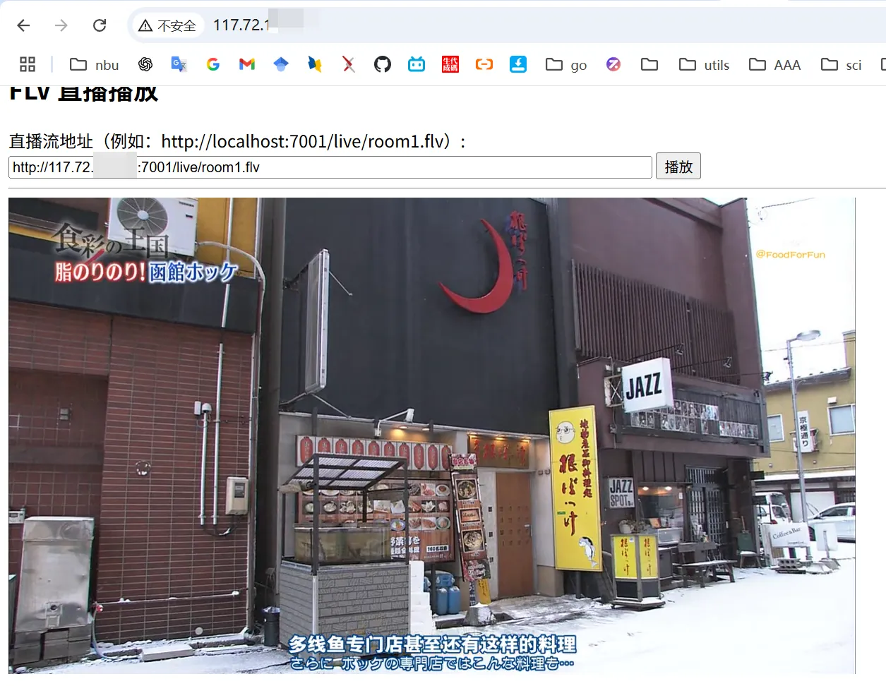


至此，windows下使用flvå®ç°æ¨æµå®Œæˆ


```yaml

1. 编译livego：`go build`
2. å¯åŠ¨livego：`livego.exe`
3. 生æˆä¸€ä¸ªæˆ¿é—´ï¼šhttp://localhost:8090/control/get?room=room1, 生æˆä¸€ä¸ª{channelkey}，直播æ¨æµçš„时候è¦ç”¨ï¼Œä½¿ç”¨ffmpeg将摄åƒå¤´çš„æµæ•°æ®æ¨å…¥è¿™ä¸ªæˆ¿é—´
4. 准备好一个flv文件：
5. flv文件æ¨æµï¼šffmpeg -re -i demo.flv -c copy -f flv rtmp://localhost:1935/{appname}/{channelkey}，{appname}一般为live，{channelKey}由第三步生æˆ
6. å¯åŠ¨å‰ç«¯ï¼šD:\code\go\Go-Live-Streaming\live-streaming-web>npm run serve
7. å‰ç«¯è®¿é—®ï¼šhttp://localhost:7001/live/room1.flv
```

### 使用本地摄åƒå¤´å®ç°æ¨æµè¿‡ç¨‹


1. 生æˆä¸€ä¸ªæˆ¿é—´ï¼š[http://117.72.184.xxx:8090/control/get?room=room2](http://117.72.184.xxx:8090/control/get?room=room2), 生æˆä¸€ä¸ª{channelkey}，直播æ¨æµçš„时候è¦ç”¨ï¼Œä½¿ç”¨ffmpeg将摄åƒå¤´çš„æµæ•°æ®æ¨å…¥è¿™ä¸ªæˆ¿é—´ï¼Œä¸‹é¢çš„data就是{channelkey}=9t5ZnlnkaAh55YCU0zBrlU9x0pCIfmRAmq9fxRlnnwAUGPoo

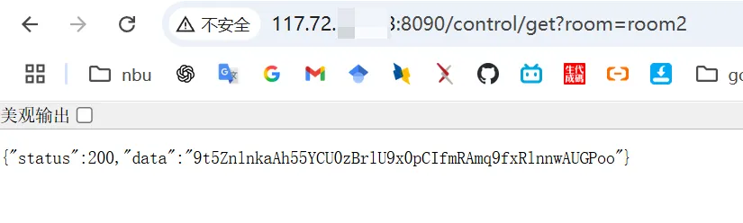


2. 查看本机支æŒçš„æ‘„åƒå¤´è®¾å¤‡ï¼š`ffmpeg -list_devices true -f dshow -i dummy`，本地有一个"HP 5MP Camera" (video)

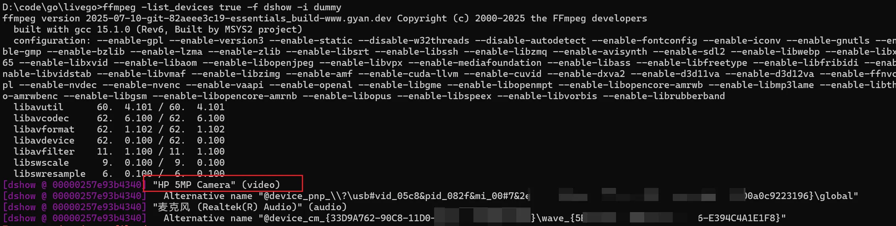


3. æ‘„åƒå¤´æ¨æµï¼š`ffmpeg -f dshow -thread_queue_size 512 -rtbufsize 100M -video_size 640x480 -framerate 15 -pixel_format yuyv422 -i video="HP 5MP Camera" -f lavfi -i anullsrc=channel_layout=stereo:sample_rate=44100 -c:v libx264 -preset veryfast -profile:v baseline -pix_fmt yuv420p -c:a aac -b:a 128k -g 30 -f flv rtmp://localhost:1935/live/{channelkey}`，如如如如如：`ffmpeg -f dshow -thread_queue_size 512 -rtbufsize 100M -video_size 640x480 -framerate 15 -pixel_format yuyv422 -i video="HP 5MP Camera" -f lavfi -i anullsrc=channel_layout=stereo:sample_rate=44100 -c:v libx264 -preset veryfast -profile:v baseline -pix_fmt yuv420p -c:a aac -b:a 128k -g 30 -f flv rtmp://117.72.184.xxx:1935/live/9t5ZnlnkaAh55YCU0zBrlU9x0pCIfmRAmq9fxRlnnwAUGPoo`


4. 访问网页：[http://117.72.184.xxx/](http://117.72.184.xxx/)，[http://117.72.184.xxx:7001/live/room2.flv](http://117.72.184.xxx:7001/live/room2.flv)


至此，windows下使用摄åƒå¤´å®ç°ç›´æ’­æ¨æµå®Œæˆ


```yaml
https://github.com/gwuhaolin/livego/blob/master/README_cn.md
1. 编译livego：go build
2. å¯åŠ¨livego：livego.exe
3. 生æˆä¸€ä¸ªæˆ¿é—´ï¼šhttp://localhost:8090/control/get?room=room1, 生æˆä¸€ä¸ª{channelkey}，直播æ¨æµçš„时候è¦ç”¨ï¼Œä½¿ç”¨ffmpeg将摄åƒå¤´çš„æµæ•°æ®æ¨å…¥è¿™ä¸ªæˆ¿é—´
4. 查看当å‰æ”¯æŒçš„设备：ffmpeg -list_devices true -f dshow -i dummy，本地有一个"HP 5MP Camera" (video)
5. æ‘„åƒå¤´æ¨æµï¼šffmpeg -f dshow -thread_queue_size 512 -rtbufsize 100M -video_size 640x480 -framerate 15 -pixel_format yuyv422 -i video="HP 5MP Camera" -f lavfi -i anullsrc=channel_layout=stereo:sample_rate=44100 -c:v libx264 -preset veryfast -profile:v baseline -pix_fmt yuv420p -c:a aac -b:a 128k -g 30 -f flv rtmp://localhost:1935/live/{channelkey}
6. å¯åŠ¨å‰ç«¯ï¼šD:\code\go\Go-Live-Streaming\live-streaming-web>npm run serve
7. å‰ç«¯è®¿é—®ï¼šhttp://localhost:7001/live/room1.flv
```


## Linux下æ¨æµ


### 使用ffmpegå®ç°flv文件æ¨æµè¿‡ç¨‹
[https://github.com/gwuhaolin/livego/blob/master/README_cn.md](https://github.com/gwuhaolin/livego/blob/master/README_cn.md)


1. 下载[https://github.com/gwuhaolin/livego/blob/master/README_cn.md](https://github.com/gwuhaolin/livego/blob/master/README_cn.md)里é¢çš„demo.flv示例文件到`/home/go/live-go/livego`目录，执行：`wget '[https://s3plus.meituan.net/v1/mss_7e425c4d9dcb4bb4918bbfa2779e6de1/mpack/default/demo.flv'](https://s3plus.meituan.net/v1/mss_7e425c4d9dcb4bb4918bbfa2779e6de1/mpack/default/demo.flv')`

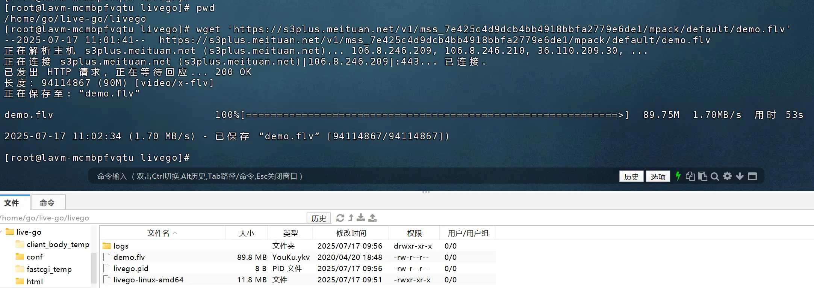


2. 生æˆä¸€ä¸ªæˆ¿é—´ï¼š[http://117.72.184.xxx:8090/control/get?room=room21](http://117.72.184.xxx:8090/control/get?room=room21), 生æˆä¸€ä¸ª{channelkey}，直播æ¨æµçš„时候è¦ç”¨ï¼Œä½¿ç”¨ffmpeg将摄åƒå¤´çš„æµæ•°æ®æ¨å…¥è¿™ä¸ªæˆ¿é—´ï¼Œä¸‹é¢çš„data就是{channelkey}=5AoXnTeA2uZRJILnhbRXLtQM8PLS1IdEaelntU0kyRAQ9I7C

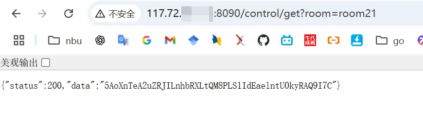


3. `/home/go/live-go/livego`下è¿è¡Œffmpeg命令å®ç°flv文件æ¨æµï¼š`ffmpeg -re -i demo.flv -c copy -f flv rtmp://localhost:1935/{appname}/{channelkey}`，{appname}一般为live，{channelKey}由上é¢ç”Ÿæˆï¼Œå¦‚：`ffmpeg -re -i demo.flv -c copy -f flv rtmp://117.72.184.xxx:1935/live/5AoXnTeA2uZRJILnhbRXLtQM8PLS1IdEaelntU0kyRAQ9I7C`

如下表示在ä¸æ–­çš„å¾€æœåŠ¡å™¨æ¨flvæµ

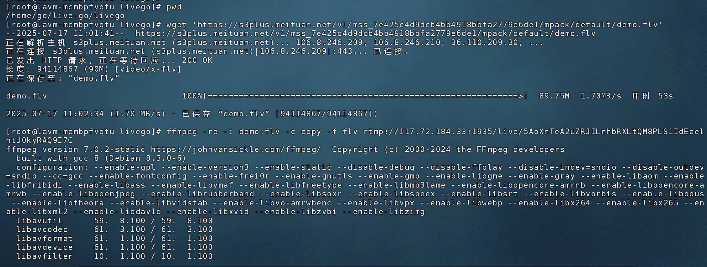


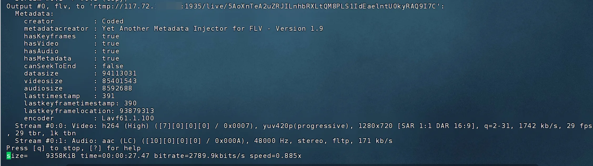


4. 访问网页：[http://117.72.184.xxx/](http://117.72.184.xxx/)，[http://117.72.184.xxx:7001/live/room21.flv](http://117.72.184.xxx:7001/live/room21.flv)

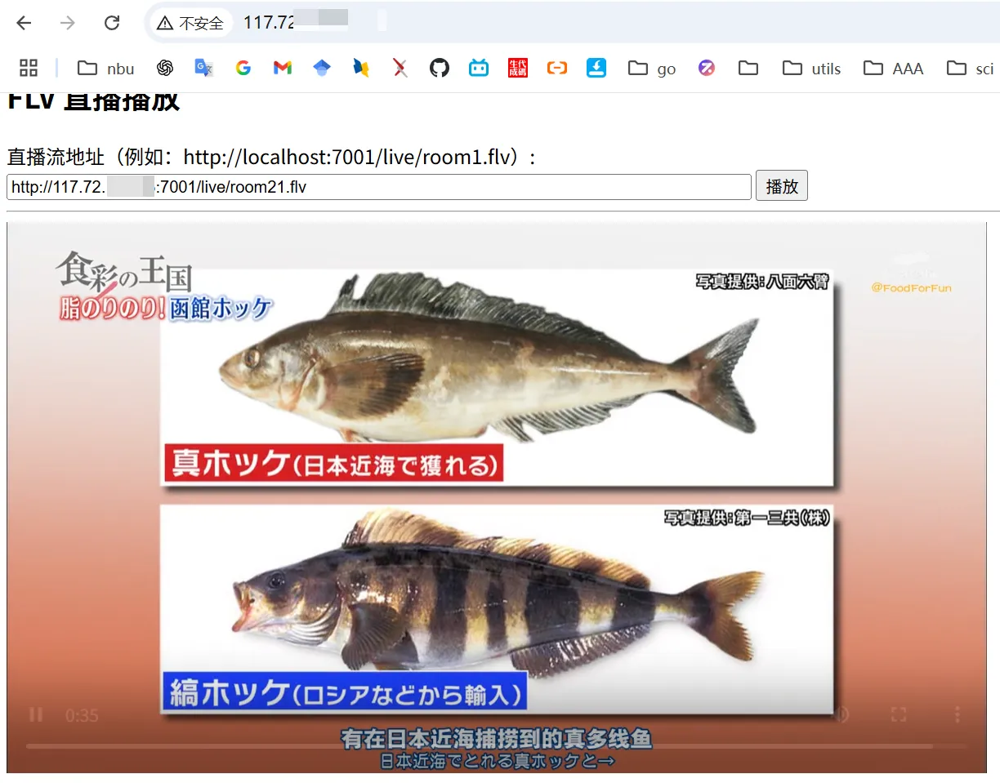


### 使用本地摄åƒå¤´å®ç°æ¨æµè¿‡ç¨‹ã€ã€ã€å¾…完æˆã€‘】】


[https://github.com/ossrs/srs](https://github.com/ossrs/srs)ã€é‡ç‚¹ã€‘

[https://github.com/steveseguin/vdo.ninja](https://github.com/steveseguin/vdo.ninja)


1. 生æˆä¸€ä¸ªæˆ¿é—´ï¼š[http://117.72.184.xxx:8090/control/get?room=room22](http://117.72.184.xxx:8090/control/get?room=room22), 生æˆä¸€ä¸ª{channelkey}，直播æ¨æµçš„时候è¦ç”¨ï¼Œä½¿ç”¨ffmpeg将摄åƒå¤´çš„æµæ•°æ®æ¨å…¥è¿™ä¸ªæˆ¿é—´ï¼Œä¸‹é¢çš„data就是{channelkey}=YQ9KjHuYVybjISGYUnhLGquIVn46m41gsgqoTfHexDR8yQrp

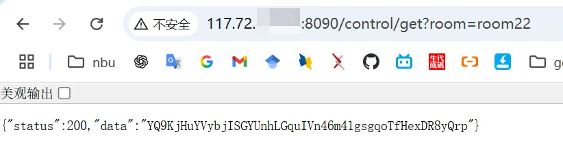


2. z：`rtmp://117.72.184.xxx:1935/live/YQ9KjHuYVybjISGYUnhLGquIVn46m41gsgqoTfHexDR8yQrp`
3. 访问网页：[http://117.72.184.xxx/](http://117.72.184.xxx/)，[http://117.72.184.xxx:7001/live/room22.flv](http://117.72.184.xxx:7001/live/room22.flv)

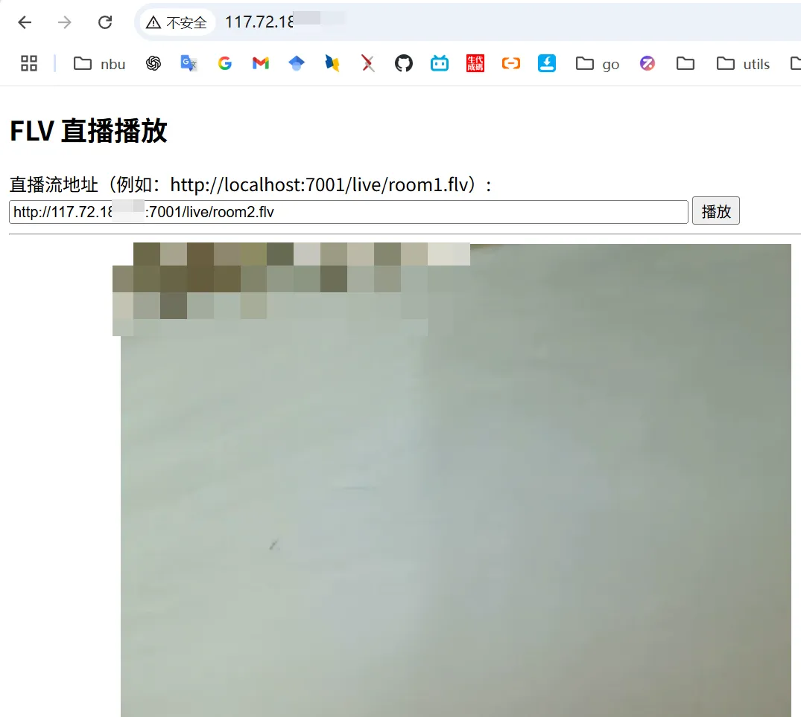


至此，windows下使用摄åƒå¤´å®ç°ç›´æ’­æ¨æµå®Œæˆ


4. z
5. æ‘„åƒå¤´æ¨æµï¼š`ffmpeg -f dshow -thread_queue_size 512 -rtbufsize 100M -video_size 640x480 -framerate 15 -pixel_format yuyv422 -i video="HP 5MP Camera" -f lavfi -i anullsrc=channel_layout=stereo:sample_rate=44100 -c:v libx264 -preset veryfast -profile:v baseline -pix_fmt yuv420p -c:a aac -b:a 128k -g 30 -f flv rtmp://localhost:1935/live/{channelkey}`，如如如如如：`ffmpeg -f dshow -thread_queue_size 512 -rtbufsize 100M -video_size 640x480 -framerate 15 -pixel_format yuyv422 -i video="HP 5MP Camera" -f lavfi -i anullsrc=channel_layout=stereo:sample_rate=44100 -c:v libx264 -preset veryfast -profile:v baseline -pix_fmt yuv420p -c:a aac -b:a 128k -g 30 -f flv rtmp://117.72.184.xxx:1935/live/9t5ZnlnkaAh55YCU0zBrlU9x0pCIfmRAmq9fxRlnnwAUGPoo`

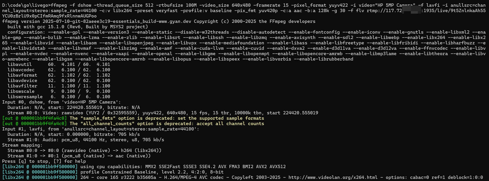


1.


# 其他


## srs和livego对比
[https://github.com/ossrs/srs](https://github.com/ossrs/srs)，[https://ossrs.io/lts/en-us/](https://ossrs.io/lts/en-us/)

[https://github.com/gwuhaolin/livego](https://github.com/gwuhaolin/livego)

| 功能/特性 | **SRS** | **LiveGo** |
| --- | --- | --- |
| æ¨æµåè®®æ”¯æŒ | RTMP / SRT / WebRTC / HLS / HTTP-FLV / GB28181 | 主è¦æ”¯æŒ RTMP æ¨æµã€HTTP-FLV 播放 |
| 播放åè®®æ”¯æŒ | HLSã€HTTP-FLVã€WebRTC ç­‰ | HTTP-FLVã€HLS（较弱） |
| 录制 | âœ…ï¼ˆæ”¯æŒ RTMP/FLV/MP4） | ✅（支æŒä½†é…置较少） |
| 延迟优化 | ✅（WebRTC 超ä½å»¶è¿Ÿæ”¯æŒï¼‰ | âŒï¼ˆå¸¸è§„ RTMP 延迟） |
| æ¨æµé‰´æƒ | ✅（支æŒå¤šç§é‰´æƒæœºåˆ¶ï¼‰ | ✅（支æŒç®€å• token 鉴æƒï¼‰ |
| 多用户/è™šæ‹Ÿä¸»æœºæ”¯æŒ | ✅ | âŒï¼ˆä¸æ”¯æŒè™šæ‹Ÿä¸»æœºï¼‰ |
| Web æ¨æµ | ✅（网页æ¨æµæ”¯æŒï¼‰ | âŒï¼ˆéœ€ç»“åˆ FFmpeg/OBS） |
| 社区活跃度 | é常活跃，Star æ•° > 20k+ | 活跃度ä½ï¼ŒStar æ•° ~6k |
| æ–‡æ¡£æ”¯æŒ | ✅（官方文档é½å…¨ã€ä¸­è‹±æ–‡ï¼‰ | 一般，主è¦æ˜¯ README å’Œ Issue |
| 性能 | 高性能，支æŒé«˜å¹¶å‘（万级è¿æ¥ï¼‰ | 中ä½æ€§èƒ½ï¼Œé€‚åˆå•æœºæµ‹è¯• |
| Docker é•œåƒ | ✅ 官方æä¾› | ✅ é官方 |
| 安装/部署 | 简å•ï¼ˆæ”¯æŒå®¹å™¨/二进制/æºç ï¼‰ | 简å•ï¼ˆäºŒè¿›åˆ¶æˆ–æºç ï¼‰ |


🔧 使用建议：

✅ æ¨è使用 SRS 的场景：

+ è¦æ„建一个稳定ã€å®Œæ•´åŠŸèƒ½çš„ **生产级直播系统**
+ éœ€è¦ **æ”¯æŒ WebRTCã€SRTã€ä½å»¶è¿Ÿ** ç­‰ç°ä»£åè®®
+ è¦åš **网页æ¨æµã€æ¨é€åˆ° CDNã€å¤šç»ˆç«¯å…¼å®¹æ’­æ”¾**
+ 希望部署在云上（如 Kubernetes + Docker）


👠æ¨è使用 LiveGo 的场景：

+ 学习直播å议（RTMPã€FLV）的基本åŸç†
+ 想快速本地测试“æ¨æµ+播放â€
+ 用äºå†…网ã€å°å‹æ¼”示ç¯å¢ƒï¼Œä¸è€ƒè™‘高并å‘


# z


